# NetMon – Bộ sơ đồ phân tích & thiết kế

Các sơ đồ vẽ theo mã nguồn hiện tại (commit trên nhánh `main`), không phải bản phác thảo. GitHub hiển thị trực tiếp Mermaid.
Sơ đồ kiến trúc tổng thể: [ARCHITECTURE.md](../ARCHITECTURE.md).

Mục lục
1. Sơ đồ ngữ cảnh (Context diagram)
2. Sơ đồ use case
3. Sơ đồ phân rã chức năng (Functional decomposition)
4. Sơ đồ khối (Block diagram)
5. Sơ đồ thành phần / gói (Component & package)
6. Sơ đồ lớp (Class diagram)
7. Sơ đồ thực thể – liên kết (ERD)
8. Sơ đồ luồng dữ liệu DFD mức 0 và mức 1
9. Sơ đồ tuần tự (Sequence diagrams)
10. Sơ đồ trạng thái (State diagrams)
11. Sơ đồ hoạt động (Activity diagrams)
12. Sơ đồ triển khai (Deployment diagram)

---

## 1. Sơ đồ ngữ cảnh

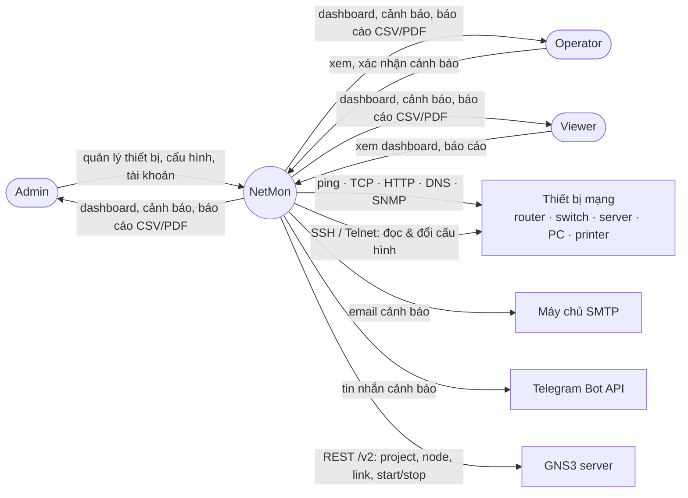
```mermaid
flowchart LR
    admin(["Admin"])
    operator(["Operator"])
    viewer(["Viewer"])
    sys(("NetMon"))
    dev["Thiết bị mạng<br/>router · switch · server · PC · printer"]
    smtp["Máy chủ SMTP"]
    tg["Telegram Bot API"]
    gns3["GNS3 server"]

    admin -- "quản lý thiết bị, cấu hình, tài khoản" --> sys
    operator -- "xem, xác nhận cảnh báo" --> sys
    viewer -- "xem dashboard, báo cáo" --> sys
    sys -- "dashboard, cảnh báo, báo cáo CSV/PDF" --> admin & operator & viewer
    sys -- "ping · TCP · HTTP · DNS · SNMP" --> dev
    sys -- "SSH / Telnet: đọc & đổi cấu hình" --> dev
    sys -- "email cảnh báo" --> smtp
    sys -- "tin nhắn cảnh báo" --> tg
    sys -- "REST /v2: project, node, link, start/stop" --> gns3
```

## 2. Sơ đồ use case

Mermaid chưa có ký hiệu use case chuẩn; dùng hình bầu dục cho use case, mũi tên từ tác nhân. Admin kế thừa mọi quyền của Operator, Operator kế thừa Viewer.

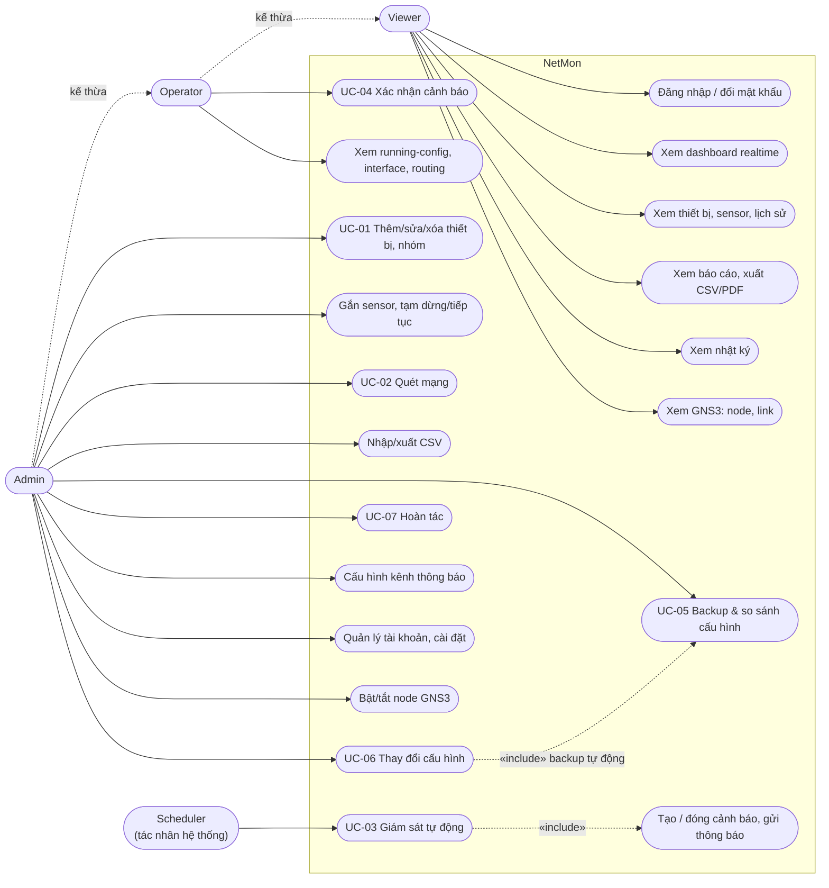
```mermaid
flowchart LR
    viewer(["Viewer"])
    operator(["Operator"])
    admin(["Admin"])
    sched(["Scheduler<br/>(tác nhân hệ thống)"])
    operator -. "kế thừa" .-> viewer
    admin -. "kế thừa" .-> operator

    subgraph NetMon
        uc0([Đăng nhập / đổi mật khẩu])
        uc1([Xem dashboard realtime])
        uc2([Xem thiết bị, sensor, lịch sử])
        uc3([Xem báo cáo, xuất CSV/PDF])
        uc4([Xem nhật ký])
        uc5([Xem GNS3: node, link])
        uc6([UC-04 Xác nhận cảnh báo])
        uc7([Xem running-config, interface, routing])
        uc8([UC-01 Thêm/sửa/xóa thiết bị, nhóm])
        uc9([Gắn sensor, tạm dừng/tiếp tục])
        uc10([UC-02 Quét mạng])
        uc11([Nhập/xuất CSV])
        uc12([UC-05 Backup & so sánh cấu hình])
        uc13([UC-06 Thay đổi cấu hình])
        uc14([UC-07 Hoàn tác])
        uc15([Cấu hình kênh thông báo])
        uc16([Quản lý tài khoản, cài đặt])
        uc17([Bật/tắt node GNS3])
        uc18([UC-03 Giám sát tự động])
        uc19([Tạo / đóng cảnh báo, gửi thông báo])
    end

    viewer --> uc0 & uc1 & uc2 & uc3 & uc4 & uc5
    operator --> uc6 & uc7
    admin --> uc8 & uc9 & uc10 & uc11 & uc12 & uc13 & uc14 & uc15 & uc16 & uc17
    sched --> uc18
    uc18 -. "«include»" .-> uc19
    uc13 -. "«include» backup tự động" .-> uc12
```

## 3. Sơ đồ phân rã chức năng

```mermaid
flowchart TB
    root["NetMon"]
    root --> f1["1. Xác thực & phân quyền"]
    root --> f2["2. Kiểm kê"]
    root --> f3["3. Giám sát"]
    root --> f4["4. Cảnh báo"]
    root --> f5["5. Báo cáo"]
    root --> f6["6. Cấu hình từ xa"]
    root --> f7["7. Hệ thống"]
    root --> f8["8. GNS3"]

    f1 --> f11["1.1 Đăng nhập / đăng xuất"]
    f1 --> f12["1.2 Khóa 5 phút sau 5 lần sai"]
    f1 --> f13["1.3 3 vai trò Admin / Operator / Viewer"]
    f1 --> f14["1.4 Đổi / đặt lại mật khẩu"]

    f2 --> f21["2.1 CRUD thiết bị theo loại"]
    f2 --> f22["2.2 Nhóm dạng cây, chống vòng"]
    f2 --> f23["2.3 Tìm kiếm, lọc, phân trang"]
    f2 --> f24["2.4 Nhập / xuất CSV"]
    f2 --> f25["2.5 Quét dải IP ≤ /22"]

    f3 --> f31["3.1 Sensor Ping / Port / HTTP / DNS / SNMP"]
    f3 --> f32["3.2 Lập lịch song song"]
    f3 --> f33["3.3 Ngưỡng WARNING, đếm lỗi trước DOWN"]
    f3 --> f34["3.4 Tạm dừng sensor / thiết bị / nhóm"]
    f3 --> f35["3.5 Dashboard realtime WebSocket"]

    f4 --> f41["4.1 Mở / tự đóng cảnh báo"]
    f4 --> f42["4.2 Xác nhận kèm ghi chú"]
    f4 --> f43["4.3 Kênh web / log / email / Telegram"]

    f5 --> f51["5.1 Lịch sử check, biểu đồ độ trễ"]
    f5 --> f52["5.2 Uptime %, số lần DOWN"]
    f5 --> f53["5.3 Xuất CSV / PDF"]

    f6 --> f61["6.1 Lưu thông tin đăng nhập (Fernet)"]
    f6 --> f62["6.2 Kiểm tra kết nối"]
    f6 --> f63["6.3 Xem config / interface / routing"]
    f6 --> f64["6.4 Backup, so sánh diff"]
    f6 --> f65["6.5 Đổi hostname / IP / bật-tắt interface"]
    f6 --> f66["6.6 Hoàn tác theo thứ tự ngược"]

    f7 --> f71["7.1 Audit log"]
    f7 --> f72["7.2 Quản lý tài khoản"]
    f7 --> f73["7.3 Cài đặt chu kỳ, thời gian giữ lịch sử"]

    f8 --> f81["8.1 Xem project / node / link"]
    f8 --> f82["8.2 Bật / tắt / khởi động lại node"]
    f8 --> f83["8.3 Ghép node với thiết bị"]
```

## 4. Sơ đồ khối

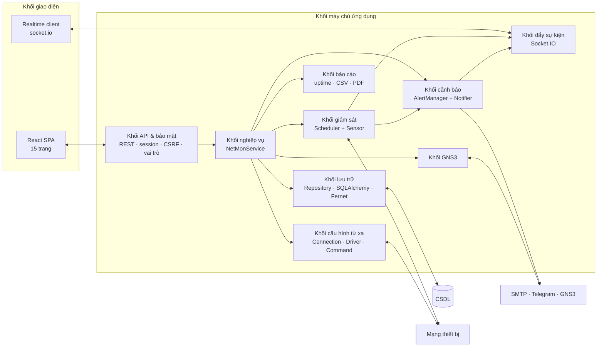
```mermaid
flowchart LR
    subgraph client["Khối giao diện"]
        ui["React SPA<br/>15 trang"]
        rt["Realtime client<br/>socket.io"]
    end

    subgraph server["Khối máy chủ ứng dụng"]
        api["Khối API & bảo mật<br/>REST · session · CSRF · vai trò"]
        ws["Khối đẩy sự kiện<br/>Socket.IO"]
        biz["Khối nghiệp vụ<br/>NetMonService"]
        mon["Khối giám sát<br/>Scheduler + Sensor"]
        alr["Khối cảnh báo<br/>AlertManager + Notifier"]
        cfg["Khối cấu hình từ xa<br/>Connection · Driver · Command"]
        rep["Khối báo cáo<br/>uptime · CSV · PDF"]
        g3["Khối GNS3"]
        per["Khối lưu trữ<br/>Repository · SQLAlchemy · Fernet"]
    end

    db[("CSDL")]
    net["Mạng thiết bị"]
    ext["SMTP · Telegram · GNS3"]

    ui <--> api
    rt <--> ws
    api --> biz
    biz --> mon & alr & cfg & rep & g3 & per
    mon --> alr
    mon --> ws
    alr --> ws
    per <--> db
    mon <--> net
    cfg <--> net
    alr --> ext
    g3 <--> ext
```

## 5. Sơ đồ thành phần / gói

Mũi tên là phụ thuộc (import). Tầng trong không biết tầng ngoài: `domain` không import Flask hay SQLAlchemy.

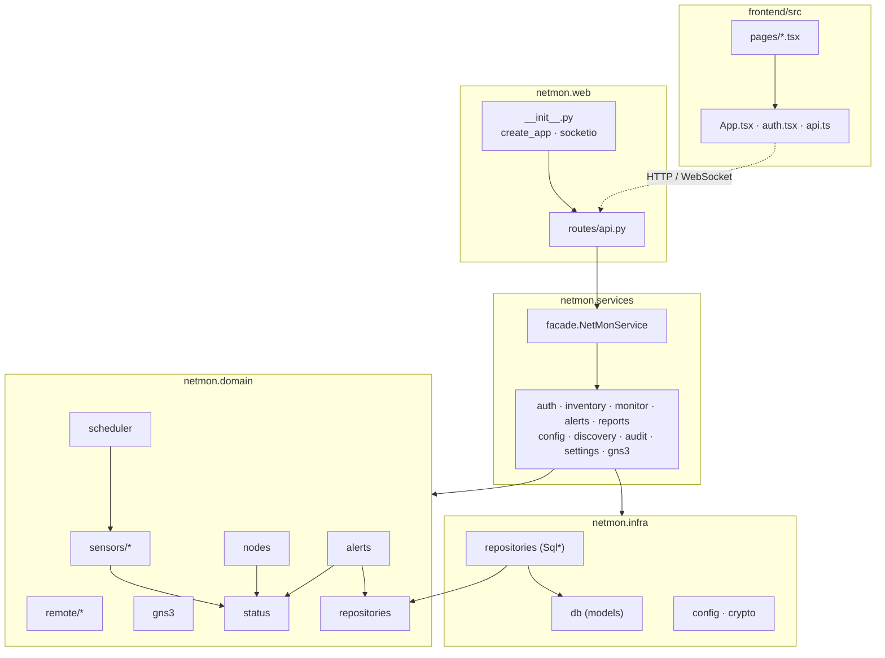
```mermaid
flowchart TB
    subgraph fe["frontend/src"]
        app["App.tsx · auth.tsx · api.ts"]
        pages["pages/*.tsx"]
    end
    subgraph web["netmon.web"]
        appf["__init__.py<br/>create_app · socketio"]
        routes["routes/api.py"]
    end
    subgraph svc["netmon.services"]
        facade["facade.NetMonService"]
        s_all["auth · inventory · monitor · alerts · reports<br/>config · discovery · audit · settings · gns3"]
    end
    subgraph dom["netmon.domain"]
        d_nodes["nodes"]
        d_sensors["sensors/*"]
        d_alerts["alerts"]
        d_sched["scheduler"]
        d_remote["remote/*"]
        d_gns3["gns3"]
        d_repo["repositories"]
        d_status["status"]
    end
    subgraph inf["netmon.infra"]
        i_db["db (models)"]
        i_repo["repositories (Sql*)"]
        i_cfg["config · crypto"]
    end

    pages --> app
    app -. "HTTP / WebSocket" .-> routes
    appf --> routes
    routes --> facade
    facade --> s_all
    s_all --> dom
    s_all --> inf
    i_repo --> d_repo
    i_repo --> i_db
    d_sensors --> d_status
    d_alerts --> d_status
    d_alerts --> d_repo
    d_sched --> d_sensors
    d_nodes --> d_status
```

## 6. Sơ đồ lớp

### 6.1 Kiểm kê & giám sát

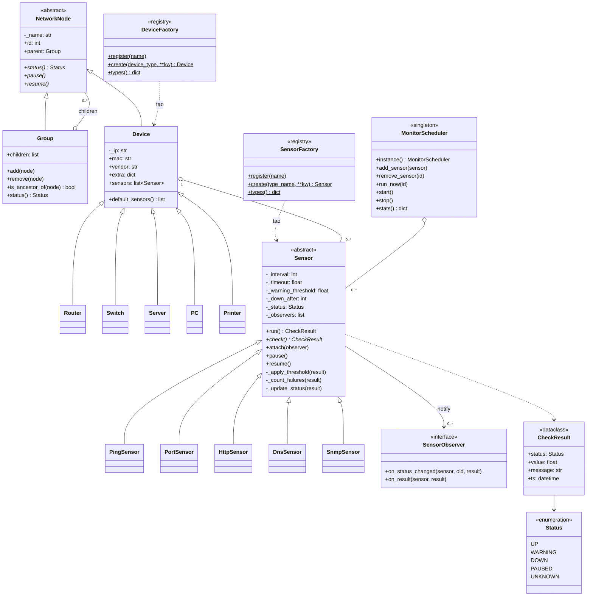
```mermaid
classDiagram
    direction TB
    class NetworkNode {
        <<abstract>>
        -_name: str
        +id: int
        +parent: Group
        +status()* Status
        +pause()*
        +resume()*
    }
    class Group {
        +children: list
        +add(node)
        +remove(node)
        +is_ancestor_of(node) bool
        +status() Status
    }
    class Device {
        -_ip: str
        +mac: str
        +vendor: str
        +extra: dict
        +sensors: list~Sensor~
        +default_sensors() list
    }
    class Router
    class Switch
    class Server
    class PC
    class Printer
    class DeviceFactory {
        <<registry>>
        +register(name)$
        +create(device_type, **kw)$ Device
        +types()$ dict
    }
    NetworkNode <|-- Group
    NetworkNode <|-- Device
    Device <|-- Router
    Device <|-- Switch
    Device <|-- Server
    Device <|-- PC
    Device <|-- Printer
    Group o-- "0..*" NetworkNode : children
    DeviceFactory ..> Device : tạo

    class Sensor {
        <<abstract>>
        -_interval: int
        -_timeout: float
        -_warning_threshold: float
        -_down_after: int
        -_status: Status
        -_observers: list
        +run() CheckResult
        +check()* CheckResult
        +attach(observer)
        +pause()
        +resume()
        -_apply_threshold(result)
        -_count_failures(result)
        -_update_status(result)
    }
    class PingSensor
    class PortSensor
    class HttpSensor
    class DnsSensor
    class SnmpSensor
    class SensorFactory {
        <<registry>>
        +register(name)$
        +create(type_name, **kw)$ Sensor
        +types()$ dict
    }
    class SensorObserver {
        <<interface>>
        +on_status_changed(sensor, old, result)
        +on_result(sensor, result)
    }
    class MonitorScheduler {
        <<singleton>>
        +instance()$ MonitorScheduler
        +add_sensor(sensor)
        +remove_sensor(id)
        +run_now(id)
        +start()
        +stop()
        +stats() dict
    }
    class CheckResult {
        <<dataclass>>
        +status: Status
        +value: float
        +message: str
        +ts: datetime
    }
    class Status {
        <<enumeration>>
        UP
        WARNING
        DOWN
        PAUSED
        UNKNOWN
    }
    Sensor <|-- PingSensor
    Sensor <|-- PortSensor
    Sensor <|-- HttpSensor
    Sensor <|-- DnsSensor
    Sensor <|-- SnmpSensor
    SensorFactory ..> Sensor : tạo
    Device "1" o-- "0..*" Sensor
    Sensor --> "0..*" SensorObserver : notify
    MonitorScheduler o-- "0..*" Sensor
    Sensor ..> CheckResult
    CheckResult --> Status
```

### 6.2 Cảnh báo

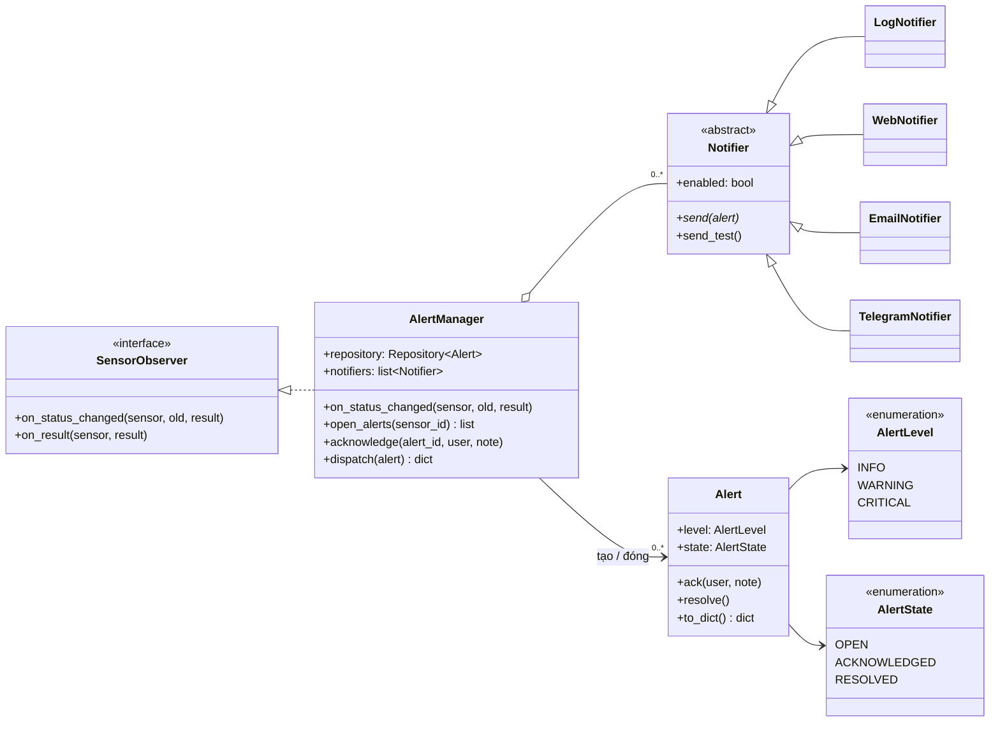
```mermaid
classDiagram
    direction LR
    class SensorObserver {
        <<interface>>
        +on_status_changed(sensor, old, result)
        +on_result(sensor, result)
    }
    class AlertManager {
        +repository: Repository~Alert~
        +notifiers: list~Notifier~
        +on_status_changed(sensor, old, result)
        +open_alerts(sensor_id) list
        +acknowledge(alert_id, user, note)
        +dispatch(alert) dict
    }
    class Alert {
        +level: AlertLevel
        +state: AlertState
        +ack(user, note)
        +resolve()
        +to_dict() dict
    }
    class AlertLevel {
        <<enumeration>>
        INFO
        WARNING
        CRITICAL
    }
    class AlertState {
        <<enumeration>>
        OPEN
        ACKNOWLEDGED
        RESOLVED
    }
    class Notifier {
        <<abstract>>
        +enabled: bool
        +send(alert)*
        +send_test()
    }
    class LogNotifier
    class WebNotifier
    class EmailNotifier
    class TelegramNotifier
    SensorObserver <|.. AlertManager
    AlertManager o-- "0..*" Notifier
    AlertManager --> "0..*" Alert : tạo / đóng
    Alert --> AlertLevel
    Alert --> AlertState
    Notifier <|-- LogNotifier
    Notifier <|-- WebNotifier
    Notifier <|-- EmailNotifier
    Notifier <|-- TelegramNotifier
```

### 6.3 Cấu hình từ xa & GNS3

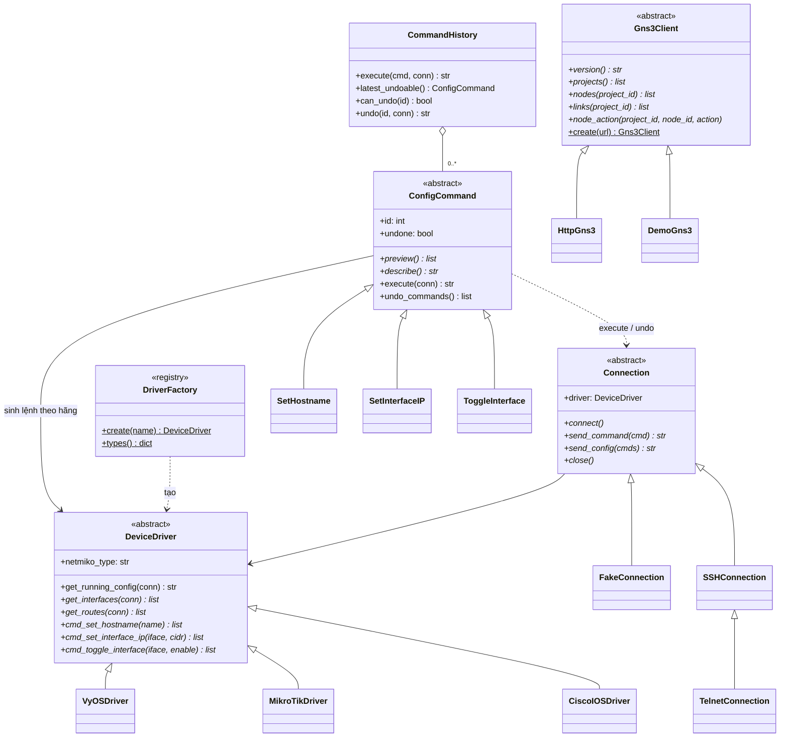
```mermaid
classDiagram
    direction TB
    class Connection {
        <<abstract>>
        +driver: DeviceDriver
        +connect()*
        +send_command(cmd)* str
        +send_config(cmds)* str
        +close()*
    }
    class SSHConnection
    class TelnetConnection
    class FakeConnection
    class DeviceDriver {
        <<abstract>>
        +netmiko_type: str
        +get_running_config(conn) str
        +get_interfaces(conn)* list
        +get_routes(conn)* list
        +cmd_set_hostname(name)* list
        +cmd_set_interface_ip(iface, cidr)* list
        +cmd_toggle_interface(iface, enable)* list
    }
    class VyOSDriver
    class MikroTikDriver
    class CiscoIOSDriver
    class DriverFactory {
        <<registry>>
        +create(name)$ DeviceDriver
        +types()$ dict
    }
    class ConfigCommand {
        <<abstract>>
        +id: int
        +undone: bool
        +preview()* list
        +describe()* str
        +execute(conn) str
        +undo_commands() list
    }
    class SetHostname
    class SetInterfaceIP
    class ToggleInterface
    class CommandHistory {
        +execute(cmd, conn) str
        +latest_undoable() ConfigCommand
        +can_undo(id) bool
        +undo(id, conn) str
    }
    Connection <|-- SSHConnection
    SSHConnection <|-- TelnetConnection
    Connection <|-- FakeConnection
    Connection --> DeviceDriver
    DeviceDriver <|-- VyOSDriver
    DeviceDriver <|-- MikroTikDriver
    DeviceDriver <|-- CiscoIOSDriver
    DriverFactory ..> DeviceDriver : tạo
    ConfigCommand <|-- SetHostname
    ConfigCommand <|-- SetInterfaceIP
    ConfigCommand <|-- ToggleInterface
    ConfigCommand --> DeviceDriver : sinh lệnh theo hãng
    CommandHistory o-- "0..*" ConfigCommand
    ConfigCommand ..> Connection : execute / undo

    class Gns3Client {
        <<abstract>>
        +version()* str
        +projects()* list
        +nodes(project_id)* list
        +links(project_id)* list
        +node_action(project_id, node_id, action)*
        +create(url)$ Gns3Client
    }
    class HttpGns3
    class DemoGns3
    Gns3Client <|-- HttpGns3
    Gns3Client <|-- DemoGns3
```

### 6.4 Tầng service (Facade) và Repository

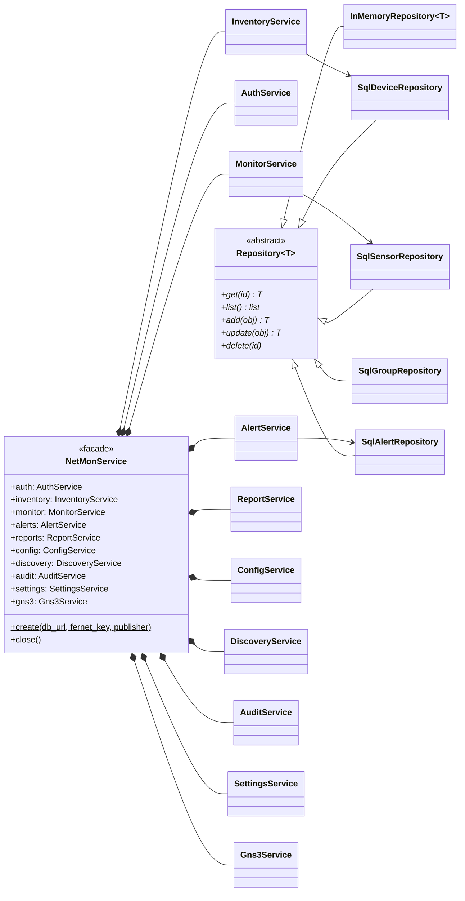
```mermaid
classDiagram
    direction LR
    class NetMonService {
        <<facade>>
        +auth: AuthService
        +inventory: InventoryService
        +monitor: MonitorService
        +alerts: AlertService
        +reports: ReportService
        +config: ConfigService
        +discovery: DiscoveryService
        +audit: AuditService
        +settings: SettingsService
        +gns3: Gns3Service
        +create(db_url, fernet_key, publisher)$
        +close()
    }
    class Repository~T~ {
        <<abstract>>
        +get(id)* T
        +list()* list
        +add(obj)* T
        +update(obj)* T
        +delete(id)*
    }
    class InMemoryRepository~T~
    class SqlDeviceRepository
    class SqlSensorRepository
    class SqlAlertRepository
    class SqlGroupRepository
    Repository <|-- InMemoryRepository
    Repository <|-- SqlDeviceRepository
    Repository <|-- SqlSensorRepository
    Repository <|-- SqlAlertRepository
    Repository <|-- SqlGroupRepository
    NetMonService *-- AuthService
    NetMonService *-- InventoryService
    NetMonService *-- MonitorService
    NetMonService *-- AlertService
    NetMonService *-- ReportService
    NetMonService *-- ConfigService
    NetMonService *-- DiscoveryService
    NetMonService *-- AuditService
    NetMonService *-- SettingsService
    NetMonService *-- Gns3Service
    InventoryService --> SqlDeviceRepository
    MonitorService --> SqlSensorRepository
    AlertService --> SqlAlertRepository
```

## 7. Sơ đồ thực thể – liên kết (ERD)

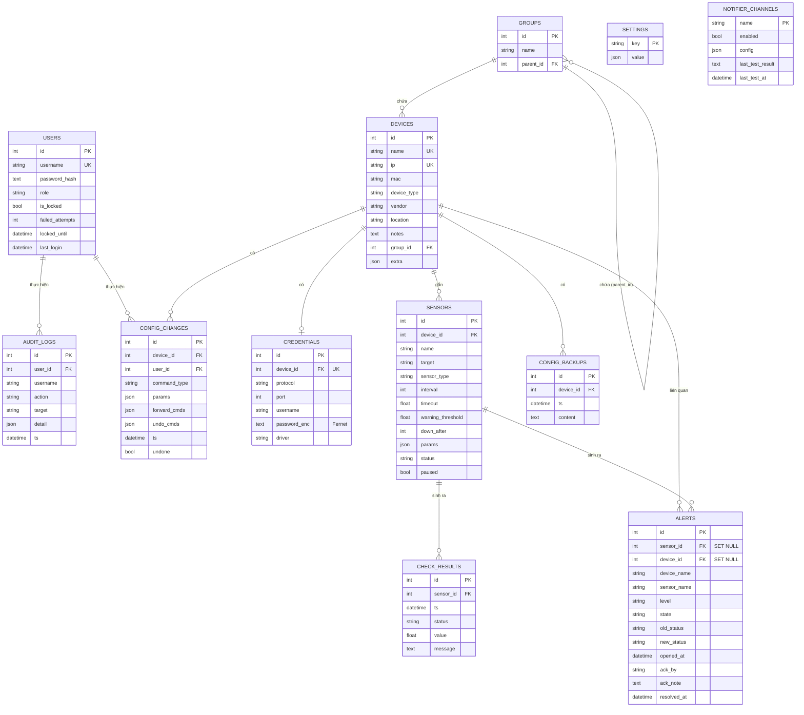
```mermaid
erDiagram
    USERS ||--o{ AUDIT_LOGS : "thực hiện"
    USERS ||--o{ CONFIG_CHANGES : "thực hiện"
    GROUPS ||--o{ GROUPS : "chứa (parent_id)"
    GROUPS ||--o{ DEVICES : "chứa"
    DEVICES ||--o| CREDENTIALS : "có"
    DEVICES ||--o{ SENSORS : "gắn"
    DEVICES ||--o{ CONFIG_BACKUPS : "có"
    DEVICES ||--o{ CONFIG_CHANGES : "có"
    DEVICES ||--o{ ALERTS : "liên quan"
    SENSORS ||--o{ CHECK_RESULTS : "sinh ra"
    SENSORS ||--o{ ALERTS : "sinh ra"

    USERS {
        int id PK
        string username UK
        text password_hash
        string role
        bool is_locked
        int failed_attempts
        datetime locked_until
        datetime last_login
    }
    GROUPS {
        int id PK
        string name
        int parent_id FK
    }
    DEVICES {
        int id PK
        string name UK
        string ip UK
        string mac
        string device_type
        string vendor
        string location
        text notes
        int group_id FK
        json extra
    }
    CREDENTIALS {
        int id PK
        int device_id FK "UK"
        string protocol
        int port
        string username
        text password_enc "Fernet"
        string driver
    }
    SENSORS {
        int id PK
        int device_id FK
        string name
        string target
        string sensor_type
        int interval
        float timeout
        float warning_threshold
        int down_after
        json params
        string status
        bool paused
    }
    CHECK_RESULTS {
        int id PK
        int sensor_id FK
        datetime ts
        string status
        float value
        text message
    }
    ALERTS {
        int id PK
        int sensor_id FK "SET NULL"
        int device_id FK "SET NULL"
        string device_name
        string sensor_name
        string level
        string state
        string old_status
        string new_status
        datetime opened_at
        string ack_by
        text ack_note
        datetime resolved_at
    }
    CONFIG_BACKUPS {
        int id PK
        int device_id FK
        datetime ts
        text content
    }
    CONFIG_CHANGES {
        int id PK
        int device_id FK
        int user_id FK
        string command_type
        json params
        json forward_cmds
        json undo_cmds
        datetime ts
        bool undone
    }
    AUDIT_LOGS {
        int id PK
        int user_id FK
        string username
        string action
        string target
        json detail
        datetime ts
    }
    SETTINGS {
        string key PK
        json value
    }
    NOTIFIER_CHANNELS {
        string name PK
        bool enabled
        json config
        text last_test_result
        datetime last_test_at
    }
```

Ghi chú: xóa thiết bị xóa kèm sensor (CASCADE) nhưng cảnh báo được giữ (SET NULL, còn lưu `device_name`, `sensor_name`) theo FR-13.

## 8. Sơ đồ luồng dữ liệu (DFD)

### 8.1 DFD mức 0

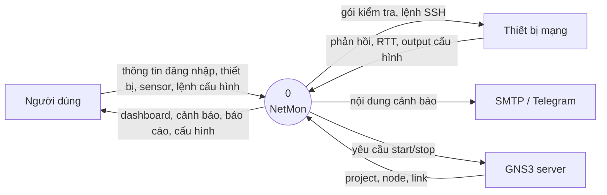
```mermaid
flowchart LR
    U["Người dùng"]
    D["Thiết bị mạng"]
    N["SMTP / Telegram"]
    G["GNS3 server"]
    P(("0<br/>NetMon"))
    U -- "thông tin đăng nhập, thiết bị, sensor, lệnh cấu hình" --> P
    P -- "dashboard, cảnh báo, báo cáo, cấu hình" --> U
    P -- "gói kiểm tra, lệnh SSH" --> D
    D -- "phản hồi, RTT, output cấu hình" --> P
    P -- "nội dung cảnh báo" --> N
    P -- "yêu cầu start/stop" --> G
    G -- "project, node, link" --> P
```

### 8.2 DFD mức 1

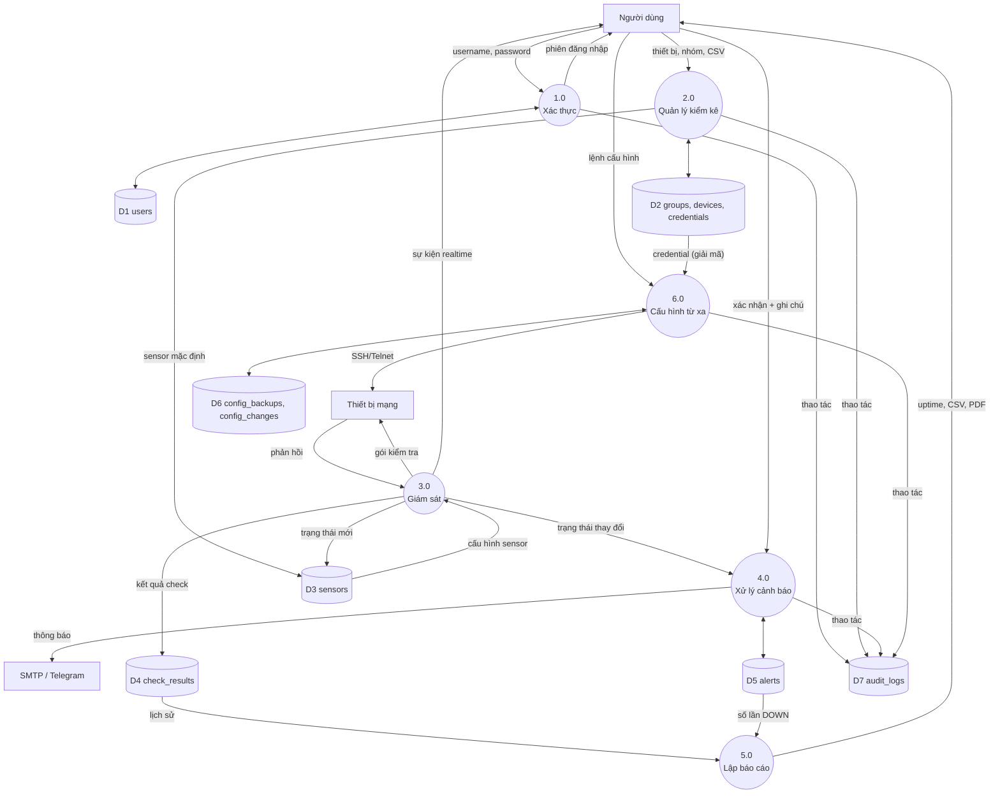
```mermaid
flowchart TB
    U["Người dùng"]
    D["Thiết bị mạng"]
    N["SMTP / Telegram"]

    p1(("1.0<br/>Xác thực"))
    p2(("2.0<br/>Quản lý kiểm kê"))
    p3(("3.0<br/>Giám sát"))
    p4(("4.0<br/>Xử lý cảnh báo"))
    p5(("5.0<br/>Lập báo cáo"))
    p6(("6.0<br/>Cấu hình từ xa"))

    d1[("D1 users")]
    d2[("D2 groups, devices, credentials")]
    d3[("D3 sensors")]
    d4[("D4 check_results")]
    d5[("D5 alerts")]
    d6[("D6 config_backups, config_changes")]
    d7[("D7 audit_logs")]

    U -- "username, password" --> p1
    p1 <--> d1
    p1 -- "phiên đăng nhập" --> U
    U -- "thiết bị, nhóm, CSV" --> p2
    p2 <--> d2
    p2 -- "sensor mặc định" --> d3
    d3 -- "cấu hình sensor" --> p3
    p3 -- "gói kiểm tra" --> D
    D -- "phản hồi" --> p3
    p3 -- "kết quả check" --> d4
    p3 -- "trạng thái mới" --> d3
    p3 -- "trạng thái thay đổi" --> p4
    p3 -- "sự kiện realtime" --> U
    p4 <--> d5
    p4 -- "thông báo" --> N
    U -- "xác nhận + ghi chú" --> p4
    d4 -- "lịch sử" --> p5
    d5 -- "số lần DOWN" --> p5
    p5 -- "uptime, CSV, PDF" --> U
    U -- "lệnh cấu hình" --> p6
    d2 -- "credential (giải mã)" --> p6
    p6 -- "SSH/Telnet" --> D
    p6 <--> d6
    p1 & p2 & p4 & p6 -- "thao tác" --> d7
```

## 9. Sơ đồ tuần tự

### 9.1 Đăng nhập và khóa tài khoản (FR-01, FR-02)

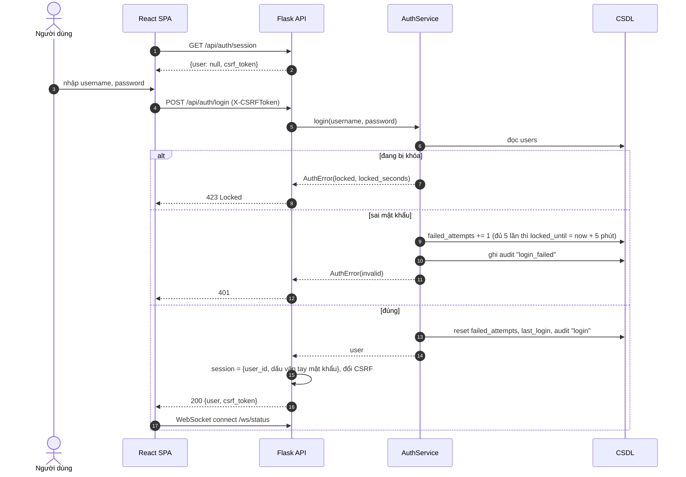
```mermaid
sequenceDiagram
    autonumber
    actor U as Người dùng
    participant FE as React SPA
    participant API as Flask API
    participant AS as AuthService
    participant DB as CSDL

    FE->>API: GET /api/auth/session
    API-->>FE: {user: null, csrf_token}
    U->>FE: nhập username, password
    FE->>API: POST /api/auth/login (X-CSRFToken)
    API->>AS: login(username, password)
    AS->>DB: đọc users
    alt đang bị khóa
        AS-->>API: AuthError(locked, locked_seconds)
        API-->>FE: 423 Locked
    else sai mật khẩu
        AS->>DB: failed_attempts += 1 (đủ 5 lần thì locked_until = now + 5 phút)
        AS->>DB: ghi audit "login_failed"
        AS-->>API: AuthError(invalid)
        API-->>FE: 401
    else đúng
        AS->>DB: reset failed_attempts, last_login, audit "login"
        AS-->>API: user
        API->>API: session = {user_id, dấu vân tay mật khẩu}, đổi CSRF
        API-->>FE: 200 {user, csrf_token}
        FE->>API: WebSocket connect /ws/status
    end
```

### 9.2 Giám sát tự động, thiết bị chết rồi sống lại (UC-03, TC-07, TC-09)

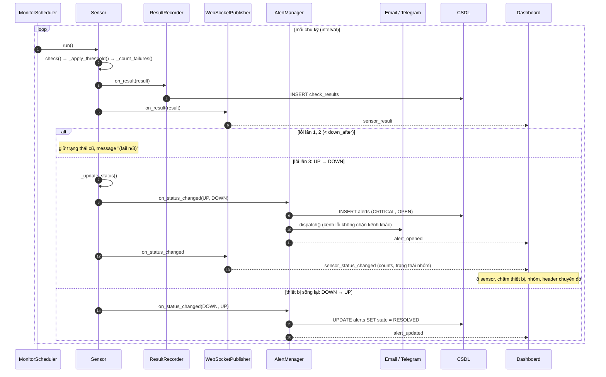
```mermaid
sequenceDiagram
    autonumber
    participant SC as MonitorScheduler
    participant S as Sensor
    participant RR as ResultRecorder
    participant WS as WebSocketPublisher
    participant AM as AlertManager
    participant NT as Email / Telegram
    participant DB as CSDL
    participant FE as Dashboard

    loop mỗi chu kỳ (interval)
        SC->>S: run()
        S->>S: check() → _apply_threshold() → _count_failures()
        S->>RR: on_result(result)
        RR->>DB: INSERT check_results
        S->>WS: on_result(result)
        WS-->>FE: sensor_result
        alt lỗi lần 1, 2 (< down_after)
            Note over S: giữ trạng thái cũ, message "(fail n/3)"
        else lỗi lần 3: UP → DOWN
            S->>S: _update_status()
            S->>AM: on_status_changed(UP, DOWN)
            AM->>DB: INSERT alerts (CRITICAL, OPEN)
            AM->>NT: dispatch() (kênh lỗi không chặn kênh khác)
            AM-->>FE: alert_opened
            S->>WS: on_status_changed
            WS-->>FE: sensor_status_changed (counts, trạng thái nhóm)
            Note over FE: ô sensor, chấm thiết bị, nhóm, header chuyển đỏ
        else thiết bị sống lại: DOWN → UP
            S->>AM: on_status_changed(DOWN, UP)
            AM->>DB: UPDATE alerts SET state = RESOLVED
            AM-->>FE: alert_updated
        end
    end
```

### 9.3 Thay đổi cấu hình và hoàn tác (UC-06, UC-07)

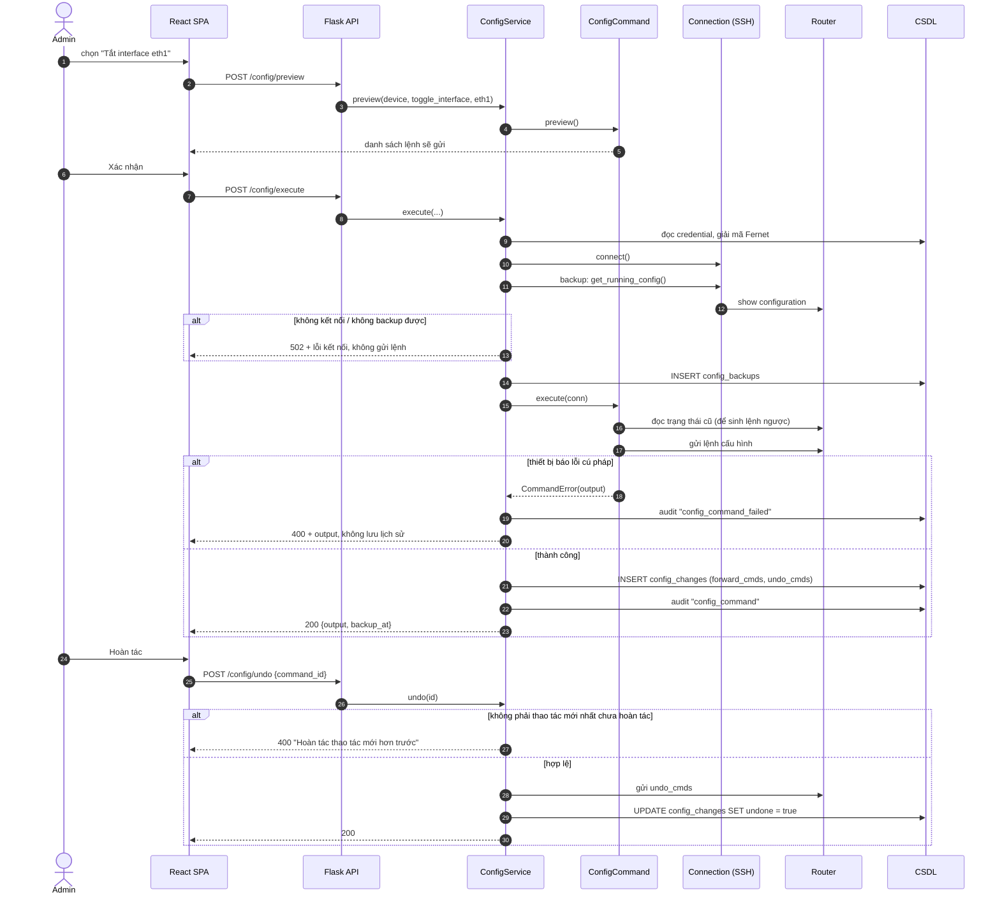
```mermaid
sequenceDiagram
    autonumber
    actor A as Admin
    participant FE as React SPA
    participant API as Flask API
    participant CS as ConfigService
    participant CMD as ConfigCommand
    participant C as Connection (SSH)
    participant R as Router
    participant DB as CSDL

    A->>FE: chọn "Tắt interface eth1"
    FE->>API: POST /config/preview
    API->>CS: preview(device, toggle_interface, eth1)
    CS->>CMD: preview()
    CMD-->>FE: danh sách lệnh sẽ gửi
    A->>FE: Xác nhận
    FE->>API: POST /config/execute
    API->>CS: execute(...)
    CS->>DB: đọc credential, giải mã Fernet
    CS->>C: connect()
    CS->>C: backup: get_running_config()
    C->>R: show configuration
    alt không kết nối / không backup được
        CS-->>FE: 502 + lỗi kết nối, không gửi lệnh
    end
    CS->>DB: INSERT config_backups
    CS->>CMD: execute(conn)
    CMD->>R: đọc trạng thái cũ (để sinh lệnh ngược)
    CMD->>R: gửi lệnh cấu hình
    alt thiết bị báo lỗi cú pháp
        CMD-->>CS: CommandError(output)
        CS->>DB: audit "config_command_failed"
        CS-->>FE: 400 + output, không lưu lịch sử
    else thành công
        CS->>DB: INSERT config_changes (forward_cmds, undo_cmds)
        CS->>DB: audit "config_command"
        CS-->>FE: 200 {output, backup_at}
    end
    A->>FE: Hoàn tác
    FE->>API: POST /config/undo {command_id}
    API->>CS: undo(id)
    alt không phải thao tác mới nhất chưa hoàn tác
        CS-->>FE: 400 "Hoàn tác thao tác mới hơn trước"
    else hợp lệ
        CS->>R: gửi undo_cmds
        CS->>DB: UPDATE config_changes SET undone = true
        CS-->>FE: 200
    end
```

### 9.4 Quét mạng (UC-02)

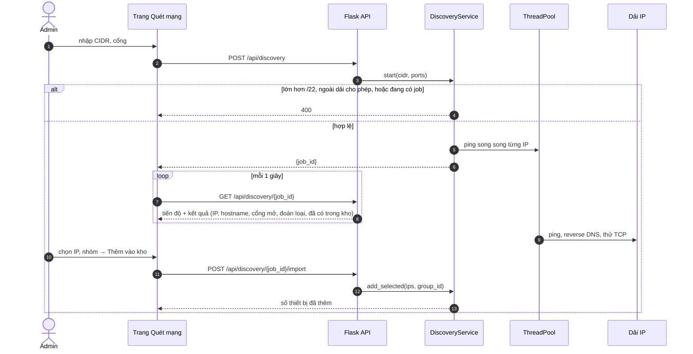
```mermaid
sequenceDiagram
    autonumber
    actor A as Admin
    participant FE as Trang Quét mạng
    participant API as Flask API
    participant DS as DiscoveryService
    participant TP as ThreadPool
    participant NET as Dải IP

    A->>FE: nhập CIDR, cổng
    FE->>API: POST /api/discovery
    API->>DS: start(cidr, ports)
    alt lớn hơn /22, ngoài dải cho phép, hoặc đang có job
        DS-->>FE: 400
    else hợp lệ
        DS->>TP: ping song song từng IP
        DS-->>FE: {job_id}
        loop mỗi 1 giây
            FE->>API: GET /api/discovery/{job_id}
            API-->>FE: tiến độ + kết quả (IP, hostname, cổng mở, đoán loại, đã có trong kho)
        end
        TP->>NET: ping, reverse DNS, thử TCP
        A->>FE: chọn IP, nhóm → Thêm vào kho
        FE->>API: POST /api/discovery/{job_id}/import
        API->>DS: add_selected(ips, group_id)
        DS-->>FE: số thiết bị đã thêm
    end
```

### 9.5 Bật/tắt node GNS3

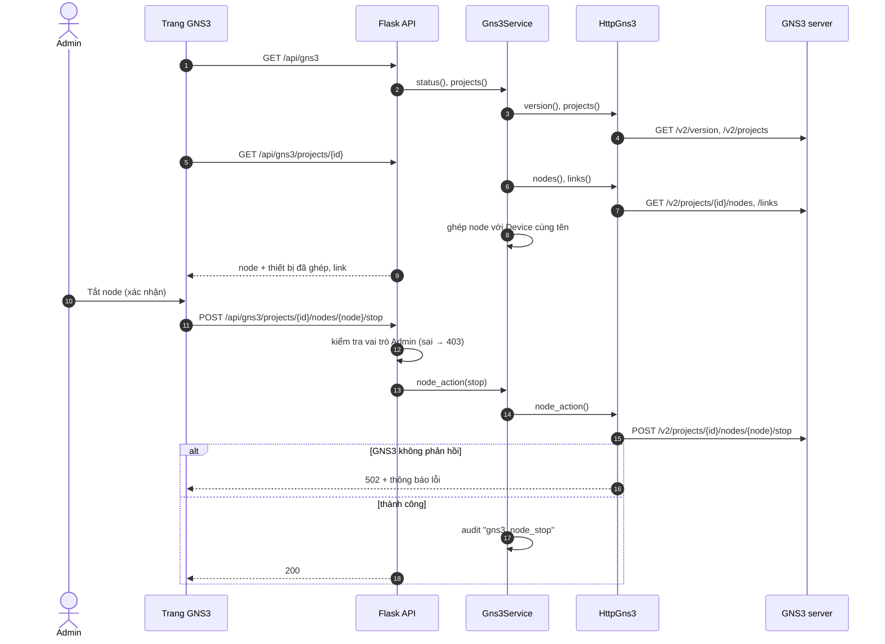
```mermaid
sequenceDiagram
    autonumber
    actor A as Admin
    participant FE as Trang GNS3
    participant API as Flask API
    participant GS as Gns3Service
    participant GC as HttpGns3
    participant G as GNS3 server

    FE->>API: GET /api/gns3
    API->>GS: status(), projects()
    GS->>GC: version(), projects()
    GC->>G: GET /v2/version, /v2/projects
    FE->>API: GET /api/gns3/projects/{id}
    GS->>GC: nodes(), links()
    GC->>G: GET /v2/projects/{id}/nodes, /links
    GS->>GS: ghép node với Device cùng tên
    API-->>FE: node + thiết bị đã ghép, link
    A->>FE: Tắt node (xác nhận)
    FE->>API: POST /api/gns3/projects/{id}/nodes/{node}/stop
    API->>API: kiểm tra vai trò Admin (sai → 403)
    API->>GS: node_action(stop)
    GS->>GC: node_action()
    GC->>G: POST /v2/projects/{id}/nodes/{node}/stop
    alt GNS3 không phản hồi
        GC-->>FE: 502 + thông báo lỗi
    else thành công
        GS->>GS: audit "gns3_node_stop"
        API-->>FE: 200
    end
```

## 10. Sơ đồ trạng thái

### 10.1 Trạng thái sensor

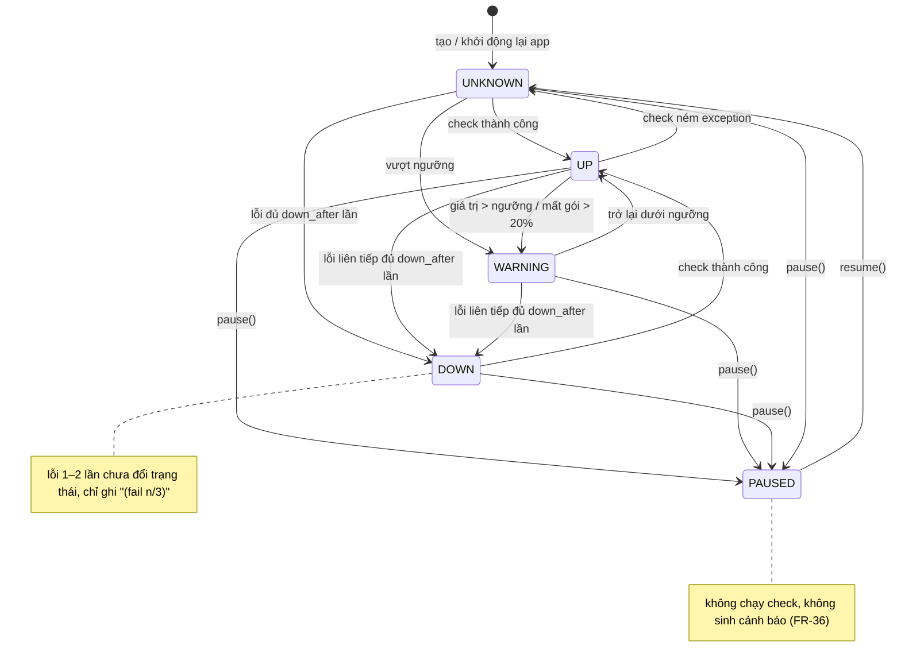
```mermaid
stateDiagram-v2
    [*] --> UNKNOWN : tạo / khởi động lại app
    UNKNOWN --> UP : check thành công
    UNKNOWN --> WARNING : vượt ngưỡng
    UNKNOWN --> DOWN : lỗi đủ down_after lần
    UP --> WARNING : giá trị > ngưỡng / mất gói > 20%
    WARNING --> UP : trở lại dưới ngưỡng
    UP --> DOWN : lỗi liên tiếp đủ down_after lần
    WARNING --> DOWN : lỗi liên tiếp đủ down_after lần
    DOWN --> UP : check thành công
    UP --> UNKNOWN : check ném exception
    UP --> PAUSED : pause()
    WARNING --> PAUSED : pause()
    DOWN --> PAUSED : pause()
    UNKNOWN --> PAUSED : pause()
    PAUSED --> UNKNOWN : resume()
    note right of PAUSED : không chạy check, không sinh cảnh báo (FR-36)
    note right of DOWN : lỗi 1–2 lần chưa đổi trạng thái, chỉ ghi "(fail n/3)"
```

### 10.2 Vòng đời cảnh báo

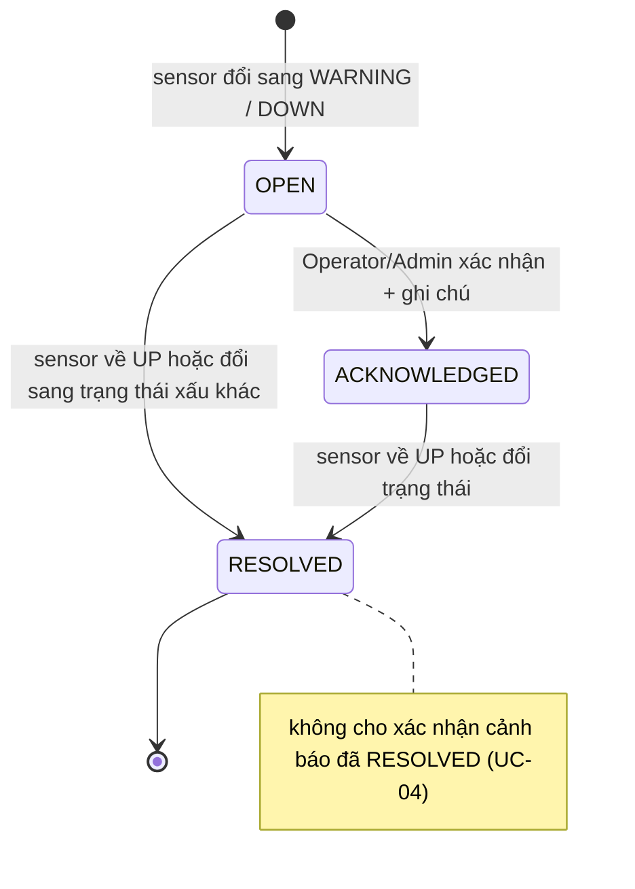
```mermaid
stateDiagram-v2
    [*] --> OPEN : sensor đổi sang WARNING / DOWN
    OPEN --> ACKNOWLEDGED : Operator/Admin xác nhận + ghi chú
    OPEN --> RESOLVED : sensor về UP hoặc đổi sang trạng thái xấu khác
    ACKNOWLEDGED --> RESOLVED : sensor về UP hoặc đổi trạng thái
    RESOLVED --> [*]
    note right of RESOLVED : không cho xác nhận cảnh báo đã RESOLVED (UC-04)
```

### 10.3 Tài khoản người dùng

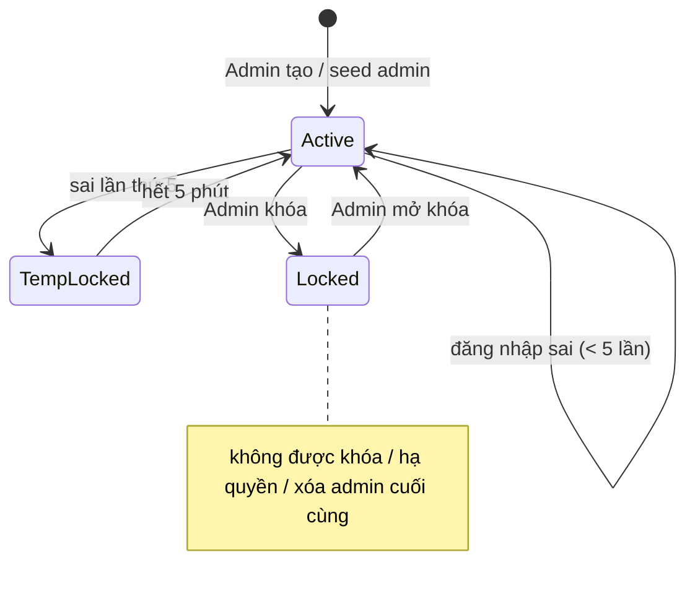
```mermaid
stateDiagram-v2
    [*] --> Active : Admin tạo / seed admin
    Active --> Active : đăng nhập sai (< 5 lần)
    Active --> TempLocked : sai lần thứ 5
    TempLocked --> Active : hết 5 phút
    Active --> Locked : Admin khóa
    Locked --> Active : Admin mở khóa
    note right of Locked : không được khóa / hạ quyền / xóa admin cuối cùng
```

## 11. Sơ đồ hoạt động

### 11.1 Thêm thiết bị (UC-01)

```mermaid
flowchart TB
    start([Bắt đầu]) --> a1[Admin mở form Thêm thiết bị]
    a1 --> a2[Chọn loại thiết bị]
    a2 --> a3[Form hiện trường riêng theo loại<br/>và tick sẵn sensor mặc định]
    a3 --> a4[Nhập tên, IP, nhóm, thông tin SSH]
    a4 --> a5[Lưu]
    a5 --> c1{IP hợp lệ IPv4?}
    c1 -- Không --> e1[Báo lỗi tại trường IP] --> a4
    c1 -- Có --> c2{Tên / IP đã tồn tại?}
    c2 -- Có --> e2[Báo trùng] --> a4
    c2 -- Không --> s1[Tạo Device qua DeviceFactory]
    s1 --> s2[Tạo sensor mặc định qua SensorFactory]
    s2 --> s3[Mã hóa mật khẩu bằng Fernet, lưu credential]
    s3 --> s4[Đăng ký sensor vào MonitorScheduler]
    s4 --> s5[Ghi audit log]
    s5 --> s6[Sensor bắt đầu chạy, dashboard cập nhật realtime]
    s6 --> stop([Kết thúc])
```

### 11.2 Một lần chạy sensor (Template Method `Sensor.run`)

```mermaid
flowchart TB
    start([Scheduler gọi run]) --> p{Đang PAUSED?}
    p -- Có --> r0[Trả PAUSED, không check] --> done([Hết])
    p -- Không --> c[check: đo theo loại sensor]
    c --> ex{Có exception?}
    ex -- Có --> u[Kết quả UNKNOWN, ghi log] --> upd
    ex -- Không --> t{UP và giá trị > ngưỡng?}
    t -- Có --> w[Đổi thành WARNING] --> f
    t -- Không --> f{Kết quả DOWN?}
    f -- Không --> z[failures = 0] --> upd
    f -- Có --> inc[failures += 1]
    inc --> k{failures ≥ down_after?}
    k -- Không --> keep[Giữ trạng thái cũ, message thêm fail n/m] --> upd
    k -- Có --> upd[_update_status]
    upd --> ch{Trạng thái đổi?}
    ch -- Có --> n1[Báo on_status_changed:<br/>AlertManager, WebSocket]
    ch -- Không --> n2
    n1 --> n2[Báo on_result: ghi CSDL, đẩy realtime]
    n2 --> done
```

## 12. Sơ đồ triển khai

```mermaid
flowchart TB
    subgraph client["Máy người dùng"]
        br["Trình duyệt Chrome/Edge"]
    end

    subgraph rw["Railway · region Southeast Asia"]
        subgraph svcapp["Service NetMon · 1 replica"]
            ct["Container Docker<br/>python:3.11-slim<br/>Gunicorn 1 worker gthread<br/>Flask + Socket.IO + Scheduler<br/>React build (static)"]
        end
        subgraph svcdb["Service Postgres"]
            pg[("PostgreSQL 18<br/>volume postgres-volume")]
        end
        edge["Railway edge · HTTPS"]
    end

    subgraph lab["Laptop / lab (chạy local)"]
        local["NetMon local<br/>python run.py hoặc docker compose"]
        g3["GNS3 server 2.2 (Docker)"]
        devs["Thiết bị lab<br/>VPCS · switch · router"]
    end

    gh["GitHub mrbrownnn/NetMon"]
    ext["SMTP · Telegram · host công cộng"]

    br -- "HTTPS + WSS" --> edge --> ct
    ct -- "mạng nội bộ railway.internal" --> pg
    ct -- "ping/HTTP/DNS, email, Telegram" --> ext
    gh -- "push main → build Dockerfile, deploy" --> ct
    local -- "REST :3080" --> g3
    local -- "SSH / ping" --> devs
    g3 --- devs
```

Railway không vào được mạng lab trên laptop; giám sát lab thật dùng NetMon chạy local (nhánh bên phải).
